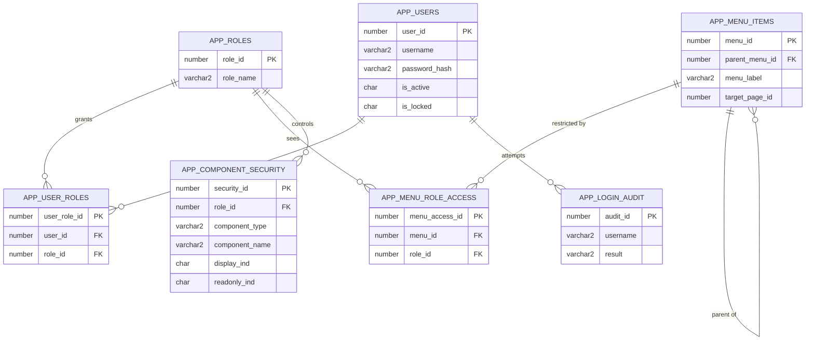
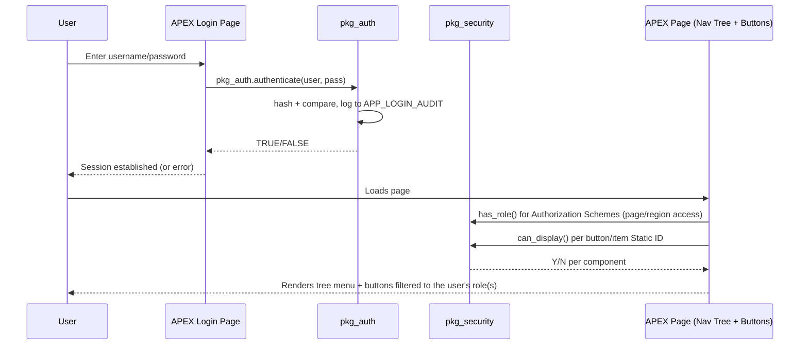

# Architecture

## Entity relationship overview

## Request flow

## Design notes

- **Roles, not per-user grants.** Every permission check goes through
  `APP_ROLES`, so adding a new user is one `APP_USER_ROLES` insert, not a
  re-check of every screen.
- **Menu tree mirrors the security table.** `APP_MENU_ITEMS` is
  self-referencing (`parent_menu_id`), so any depth of tree is possible;
  `APP_MENU_ROLE_ACCESS` decides which nodes render for the logged-in
  user's role(s) — hidden parents with no visible children simply
  disappear from the rendered tree.
- **Button security is generic**, not hard-coded per page: one table
  (`APP_COMPONENT_SECURITY`) covers pages, regions, buttons, items, and
  columns, keyed by each component's APEX Static ID.
- **Passwords are always hashed+salted** (`DBMS_CRYPTO.HASH`, SHA-512) —
  the plain password never touches the table.
